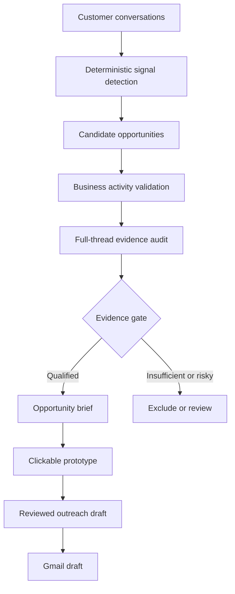

# Workflow Opportunity Lab

**An evidence-backed discovery system that turns recurring customer problems into reviewable software opportunities, briefs and prototypes.**

`Python` · `SQLite` · `Gmail API` · `Signal Detection` · `Prototype Generation`

## At a glance

| | |
|---|---|
| **Business problem** | Valuable workflow problems were buried inside customer conversations |
| **Primary user** | Product or growth operator evaluating new service opportunities |
| **System role** | Detect, audit, qualify and package operational problems |
| **AI role** | Opportunity framing and prototype support after evidence gates |
| **Control model** | Customer-authored evidence, business validation and human pilot selection |

## The problem

Customers frequently describe coordination failures, intake friction, repeated
status requests and manual workflows in ordinary project conversations. Those
signals are easy to miss when every thread is reviewed in isolation.

I designed a discovery lab that converts recurring evidence into a structured
decision process without treating every keyword as a product opportunity.

## How it works

## Core capabilities

- Detects workflow signals such as intake, dispatch, tracking and approvals
- Separates core-business evidence from supplier-only communication
- Scores candidates using evidence volume, relevance and relationship strength
- Validates that the business appears active
- Audits full threads before qualification
- Requires multiple distinct customer-authored facts for strong opportunities
- Records evidence text and provenance for review
- Produces structured opportunity briefs and required-screen definitions
- Generates clickable concept prototypes
- Selects a limited pilot set instead of treating every candidate as qualified
- Prepares reviewable outreach and Gmail drafts

## Technology stack

| Layer | Technology |
|---|---|
| Analysis | Python |
| Data | SQLite |
| Email evidence | Gmail API |
| Detection | Deterministic signal rules and scoring |
| Outputs | JSON briefs, HTML prototypes and captured screens |
| Delivery | Reviewable Gmail drafts |
| Validation | Automated tests plus manual evidence audit |

## Key design decisions

1. Require customer-authored evidence, not generic industry assumptions.
2. Separate keyword discovery from full-thread qualification.
3. Exclude relationship risk before proposing additional work.
4. Validate a small pilot set before scaling the workflow.
5. Generate outreach only after the brief and prototype are reviewable.

## My contribution

I designed the opportunity-detection framework, evidence gates, qualification
workflow and brief-to-prototype process, then directed the AI-assisted
implementation and evaluation of the system.

## Further documentation

- [Architecture](docs/architecture.md)
- [Capabilities](docs/capabilities.md)
- [Design decisions](docs/design-decisions.md)
- [Evidence boundaries](docs/evidence.md)
- [Fictional opportunity example](examples/fictional-workflow.md)

## Public repository boundary

This case study excludes customer conversations, names, domains, prototype
assets, outreach copy, credentials and original private source code.

